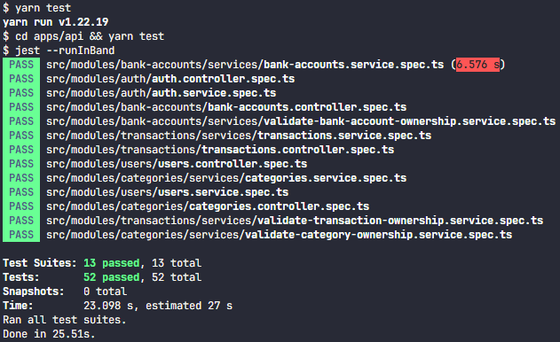

  
   
  <h1>Fincheck: Gerenciamento Simples e Eficaz das Suas Finanças Pessoais</h1>
  <h2>Explore a plataforma em: <a target="_blank" href="https://fi-rmst.onrender.com">Fincheck</a></h2>

 

# Sobre o Fincheck

O Fincheck é a solução simples para o gerenciamento eficaz de suas finanças pessoais. Projetado para proporcionar uma experiência descomplicada, o Fincheck permite que você mantenha o controle total do seu dinheiro, evitando surpresas desagradáveis no final do mês.

## Em Desenvolvimento

O Fincheck está em constante evolução! Planejo implementar novas funcionalidades para tornar sua experiência ainda mais completa, incluindo:

- Recuperação de senha por e-mail;
- Cadastro e login via Google;
- Balanço geral;

# Tecnologias Utilizadas

## Front-end

- React.js
- Typescript
- Tailwind CSS
- Radix UI
- Headless UI
- React Query
- Axios
- Zod

## Back-end

- NestJS
- Typescript
- Prisma
- PostgreSQL
- API REST
- Swagger
- JWT (Autenticação)
- Jest

## Testes

Para a realização dos testes, clone o repositório e execute o seguinte comando para a instalação de dependências:

`yarn`

Em seguida, execute o comando para então realizar os testes:

`yarn test`

Você deve ver uma tela parecida com a imagem abaixo:

 

Ainda, para explorar a documentação completa das rotas, acesse: <a target="_blank" href="https://fi-rmst.onrender.com/api#">Documentação da API</a>
